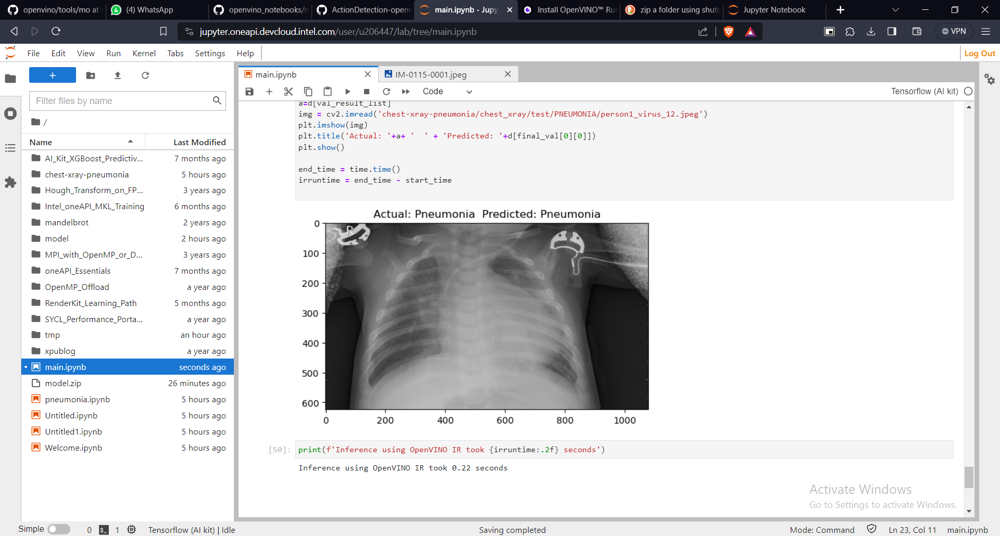

<div align="center">
<h1 align="center">
<br>PNEUMONIA__DETECTION_INTELONEAPI</h1>
</div>
 


## DEDUCTION OF PNEUMONIA  USING CHEST X RAY IMAGES
Our project focuses on pneumonia detection using a dataset of chest X-ray images. It begins with feature extraction using OpenCV and the construction of a Convolutional Neural Network (CNN) model. This model incorporates essential layers, including Conv2D, BatchNormalization, MaxPooling2D, Flatten, Dense, and Dropout, to enhance its learning capabilities. After rigorous training and validation, the model achieves an impressive accuracy of 96.24%. Notably, our project evaluates runtime execution by testing the model with both TensorFlow and Intel OpenVINO IR models. Surprisingly, OpenVINO outperforms TensorFlow, completing the task in half the time, highlighting a substantial improvement in inference speed. 🚀 Additionally, the implementation of OpenVINO has resulted in execution time reduction in runtime execution, significantly enhancing the speed and efficiency of our pneumonia detection system.
___


## PROJECT FLOW
In this project, our initial model training and execution were conducted without harnessing the advantages of Intel's optimized libraries and the oneAPI toolkit. Although our accuracy was satisfactory, there was clear potential for enhancing the efficiency of our system. By seamlessly deploying it using OpenVINO IR models, we not only maintained our accuracy levels but also witnessed a significant boost in efficiency. This optimization led to reduced runtime and effectively distributed the hardware load during the training process, resulting in a more streamlined and high-performance system. A pivotal component of this project was the utilization of the Intel oneAPI devcloud, which provided a swift and finely-tuned environment, contributing to the successful completion of our objectives.
___


## Screenshots

Tensorflow runtime : 0.32 



OpenVino IR runtime : 0.22 Sec


After completion of testing it clearly shows that openvino outperformed the tensorflow by runtime execution and performance.

___

## ONE API
OneAPI is a revolutionary, open, and standards-based programming model that liberates developers from the constraints of working with multiple hardware architectures, such as CPUs, GPUs, FPGAs, and diverse accelerators. With OneAPI, developers can utilize a single codebase across this spectrum, leading to accelerated computation while avoiding dependency on specific hardware vendors. This approach aligns with Intel's broader vision to establish a cohesive and adaptable software ecosystem tailored for the demands of high-performance computing and data analytics.
___

## OPEN VINO
OpenVINO, short for Open Visual Inference and Neural network Optimization, is a powerful open-source toolkit designed to enhance and streamline the deployment of AI inference. It offers a range of features and components aimed at optimizing deep learning performance in various applications, including computer vision, automatic speech recognition, natural language processing, and more.  The key highlights of OpenVINO:

Performance Enhancement: OpenVINO significantly boosts the performance of deep learning models, making them more efficient in tasks related to computer vision, speech recognition, and natural language processing. This acceleration is crucial for real-time and resource-constrained applications.

Framework Flexibility: It supports models trained with popular deep learning frameworks like TensorFlow, PyTorch, and others. This versatility allows developers to leverage their existing models and frameworks seamlessly.
___


## REPO STRUCTURE

```sh
└── PNEUMONIA__detection_IntelONEAPI/
    ├── model/
    │   ├── model.bin
    │   └── tf/
    │       ├── fingerprint.pb
    │       ├── keras_metadata.pb
    │       ├── saved_model.pb
    │       └── variables/
    ├── openvinoIRruntime.PNG
    ├── PNEUMONIA__detection_intelONEAPI.ipynb
    └── tensorflowruntime.PNG

```

____


## Installation

Clone the PNEUMONIA__detection_IntelONEAPI.ipynb repository:

```bash
  git clone
  https://github.com/aasima007/PNEUMONIA__detection_IntelONEAPI
```
Change to the project directory

```bash
cd PNEUMONIA__detection_IntelONEAPI
```
Install the dependencies:
```bash
!pip install opencv-python scikit-learn-intelex tensorflow==2.13 pandas openvino-dev numpy pandas matplotlib
```
 Running PNEUMONIA__detection_IntelONEAPI
 ```bash
jupyter nbconvert --execute notebook.ipynb
```

___


## 🚀 Getting Started

***Dependencies***

Dependencies for the project:  

`- ℹ️ OPENVINO`

`- ℹ️ OpenCV`

`- ℹ️ Tensorflow`

`- ℹ️ Sklearn(intel optimsed version of scikit-learn libraires)`

`- ℹ️ numpy`

`- ℹ️ pandas`

`- ℹ️ matplotlib`
